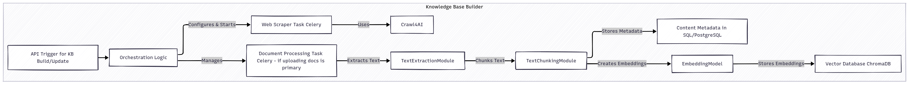

# Catalyst 🚀

Catalyst is a modular and extensible platform that brings together the power of FastAPI, Streamlit, Celery, and LLMs (Large Language Models) to deliver a seamless experience for knowledge management, quiz generation, interview simulation, personal assistance, and more!

---

## 📚 Table of Contents
- [✨ Overview](#-overview)
- [🗺️ High-Level Design](#-high-level-design)
- [🧩 Modules](#-modules)
  - [🖥️ Web UI (Streamlit)](#️-web-ui-streamlit)
  - [⚡ API (FastAPI)](#-api-fastapi)
  - [📖 Knowledge Base Builder](#-knowledge-base-builder)
  - [🔎 RAG Pipeline](#-rag-pipeline)
  - [📝 Quiz Generator](#-quiz-generator)
  - [🎤 Interview Simulator](#-interview-simulator)
  - [🤖 Personal Assistant](#-personal-assistant)
  - [📦 Task Queue (Celery)](#-task-queue-celery)
  - [📊 Logging & Monitoring](#-logging-monitoring)
- [🖼️ Design Assets](#-design-assets)
- [📝 License](#-license)

---

## ✨ Overview
Catalyst is designed to provide a delightful and productive experience for users by integrating a variety of intelligent modules into a single, easy-to-use platform. Whether you're building a knowledge base, generating quizzes, simulating interviews, or seeking personal assistance, Catalyst has you covered!

---

## 🗺️ High-Level Design

  

At a glance, Catalyst consists of:
- **Web UI (Streamlit)**: User-friendly interface for seamless interaction.
- **API (FastAPI)**: The robust backend that orchestrates all modules.
- **Knowledge Base Builder**: Gathers and processes knowledge from various sources.
- **RAG Pipeline**: Answers user queries with context-aware intelligence.
- **Quiz Generator**: Creates engaging quizzes on demand.
- **Interview Simulator**: Prepares users for real-world interviews.
- **Personal Assistant**: Offers personalized guidance and suggestions.
- **Task Queue (Celery)**: Handles background jobs efficiently.
- **Logging & Monitoring**: Keeps everything running smoothly and transparently.

---

## 🧩 Modules

### 🖥️ Web UI (Streamlit)

  

- Intuitive user input components
- Real-time API communication
- Beautiful response displays

### ⚡ API (FastAPI)
- Central hub for all requests and responses
- Validates, processes, and routes data
- Connects seamlessly with all modules

### 📖 Knowledge Base Builder

  

- Scrapes and processes data from the web and documents
- Chunks, embeds, and stores knowledge efficiently
- Uses Crawl4AI, ChromaDB, and SQL/PostgreSQL

### 🔎 RAG Pipeline

  

- Encodes queries and retrieves relevant knowledge
- Leverages LLMs for context-rich answers

### 📝 Quiz Generator

  

- Generates quizzes based on topics and parameters
- Uses LLMs for creative question/answer generation
- Stores results in SQL/PostgreSQL

### 🎤 Interview Simulator

  

- Parses resumes and builds user profiles
- Simulates interview Q&A with LLMs
- Provides instant feedback and evaluation

### 🤖 Personal Assistant

  

- Tracks user context and progress
- Offers personalized suggestions and next steps

### 📦 Task Queue (Celery)

  

- Manages background jobs (web scraping, processing, etc.)
- Integrates with Redis and other services

### 📊 Logging & Monitoring

  

- Logs all important events
- Collects metrics for performance and health
- Ready for integration with tools like Grafana

---

## 🖼️ Design Assets
All design diagrams and visual assets are described in detail in the [assets/README.md](assets/README.md) file. Check it out for a quick reference to each diagram and its purpose!

---

## 📝 License
This project is licensed under the Apache License 2.0. See the [LICENSE](LICENSE) file for details.