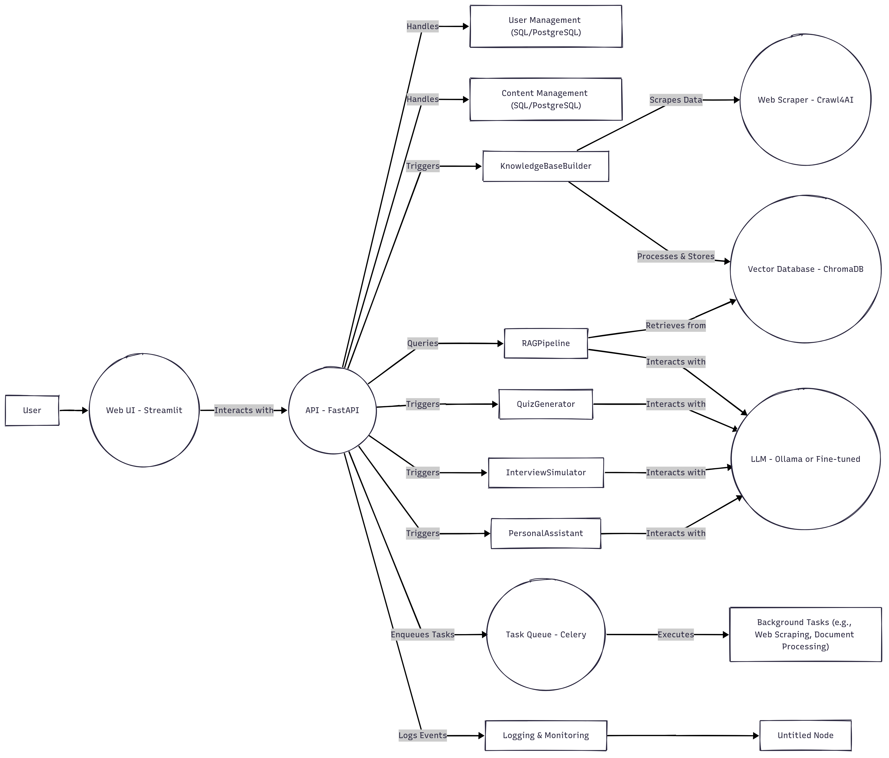
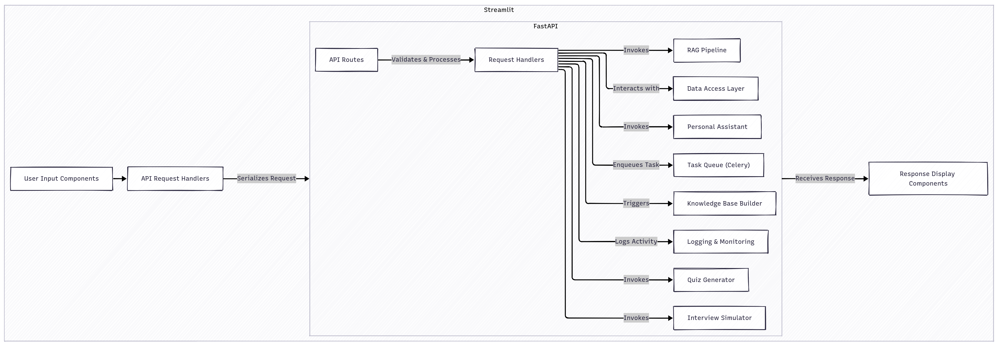
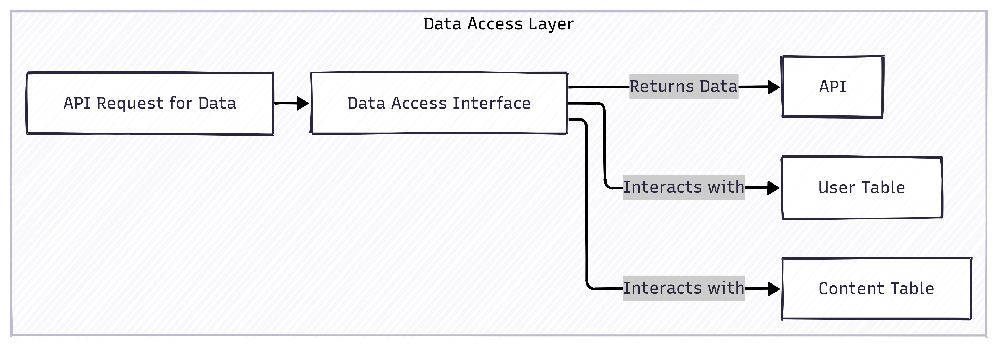
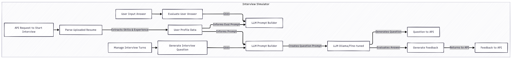
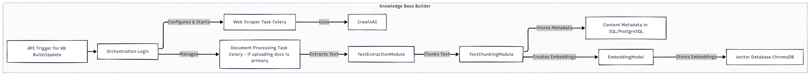
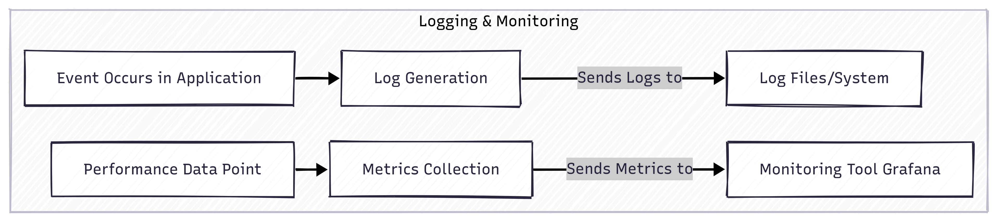
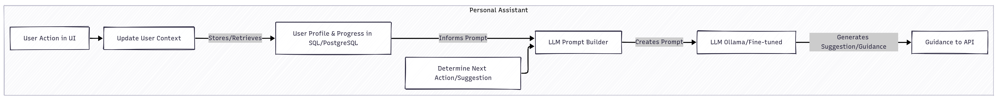
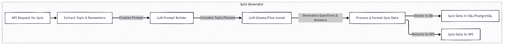
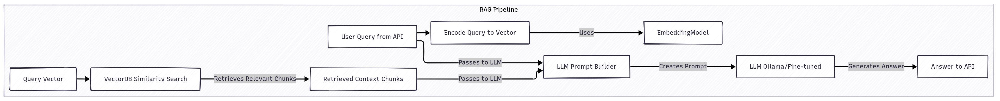

# 🖼️ Catalyst Assets

Welcome to the Catalyst design assets folder! Here you'll find all the visual diagrams that bring the architecture and modules of Catalyst to life. Each image helps you understand how different parts of the system work together. 

## 📂 Asset Descriptions

| Image | Description |
|-------|-------------|
|  | **Catalyst-High-Level-Design.png** 🗺️ High-level architecture of the Catalyst system. |
|  | **Catalyst-Low-Level-Design.png** 🔍 Detailed design of the Web UI and API components. |
|  | **Data-Access-Layer-Design.png** 💾 Data Access Layer design, including SQL database interactions. |
|  | **Interview-Simulator-Design.png** 🎤 Workflow of the Interview Simulator module. |
|  | **Knowledge-Base-Builder-Design.png** 📖 Architecture of the Knowledge Base Builder module. |
|  | **Logging-Monitoring-Design.png** 📊 Overview of the Logging & Monitoring system. |
|  | **Personal-Assistant-Design.png** 🤖 Design of the Personal Assistant module. |
|  | **Quiz-Generator-Design.png** 📝 Workflow of the Quiz Generator module. |
|  | **RAG-Pipeline-Design.png** 🔎 Design of the Retrieval-Augmented Generation (RAG) Pipeline. |
|  | **Task-Queue-Celery-Design.png** 📦 Architecture of the Task Queue system using Celery. |

---

✨ Each diagram is referenced in the main [README](../README.md) for context. Use these visuals to quickly grasp how Catalyst's modules interact and function!